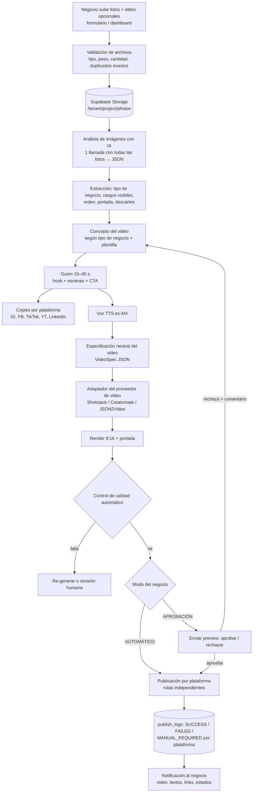
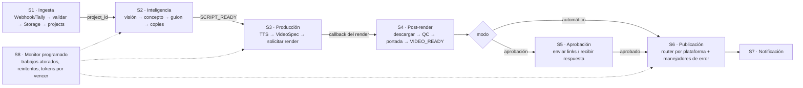
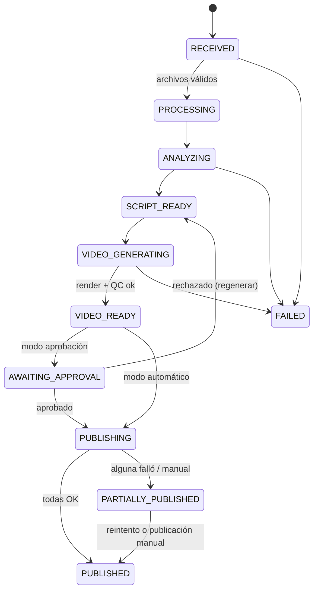
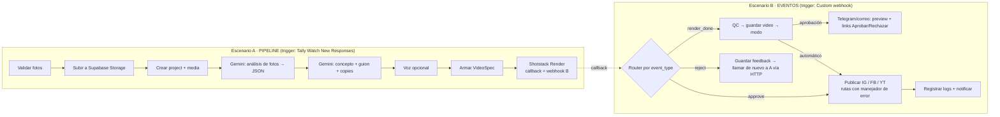

# Automatización "Fotos → Video → Redes" — ETAPA 1: Arquitectura

> Estado: **propuesta para revisión**. No se ha construido ningún escenario todavía.
> Fecha de la investigación: **23-sep-2026**. Precios y límites cambian con frecuencia; cada cifra marcada con "≈" es una estimación que debe re-verificarse antes de cotizar a clientes.

---

## 0. Resumen ejecutivo

| Pregunta | Respuesta corta |
|---|---|
| ¿Es automatizable de punta a punta? | **Sí para Instagram, Facebook Pages, YouTube y LinkedIn.** **TikTok no** tiene módulo de publicación en Make; requiere API propia auditada o un agregador. |
| ¿Dónde vive la lógica? | **Make** orquesta. **Supabase** guarda datos, archivos y estado (multi-cliente con RLS). Los proveedores de IA, voz y video se llaman por módulo nativo o HTTP y son **intercambiables**. |
| ¿Cuánto cuesta por video? | Costo variable ≈ **US$0.15–0.55** por video de 30 s. Con los costos fijos incluidos: ≈ **US$0.90** (100/mes), ≈ **US$0.50–0.70** (500/mes), ≈ **US$0.40–0.55** (1,000/mes). |
| ¿Qué requiere humanos? | Conectar cuentas sociales (OAuth, una vez por cliente), aprobar videos (modo aprobación), TikTok mientras no haya auditoría, perfiles personales de Facebook, y las revisiones de apps (Meta/TikTok/Google/LinkedIn) si en fase SaaS usamos apps propias. |
| Recomendación de arranque | ~~Supabase + Make + Claude + ElevenLabs + Shotstack + Zernio~~ → **Actualizado (v2): stack de costo mínimo para inmobiliarias y tiendas de ropa. Ver §13.** |

> **v2 (decisión del cliente):** prioridad = **costo mínimo**; verticales iniciales = **inmobiliarias** y **tiendas de ropa**. La §13 sustituye a las recomendaciones de §9, §11 y §12 donde se contradigan.

---

## 1. Lo que verifiqué (no supuse)

### 1.1 Módulos que existen hoy en Make

Lo consulté directamente en tu cuenta de Make (zona `us2.make.com`, organización 7426317) con la API de Make, no desde la memoria.

| Necesidad | App en Make (`nombre@versión`) | Módulos confirmados relevantes | Veredicto |
|---|---|---|---|
| Publicar en Instagram | `instagram-business@1` | **Create a reel post**, Create a carousel post, Create a photo post, Get post insights | ✅ Nativo |
| Publicar en Facebook Page | `facebook-pages@6` | **Publish a Reel**, **Upload a Video**, Create a Post, Create a Post with Photos, Get a Video | ✅ Nativo |
| Publicar en YouTube | `youtube@4` | **Upload a Video**, Set a Video Thumbnail, Update a Video Details, Make an API Call | ✅ Nativo |
| Publicar en LinkedIn | `linkedin@2` | **Create a Company Video Post**, Create a User Video Post, Create a Company Image Post | ✅ Nativo |
| Publicar en TikTok | `tiktok@1` | Solo **Ads** (campañas, anuncios) y "List/Watch TikTok Video Posts (legacy)". **No existe un módulo para publicar videos.** | ❌ No nativo |
| TikTok vía agregador | `make-nodes-late@1` (Late/Zernio) | **Add a Post to Tiktok**, Add an Instagram Reel, Add a Video to Youtube, Add a Post to LinkedIn, Add a Post to Facebook, Retry Adding a Post, Get a Post by ID | ✅ Nativo (servicio de terceros de pago) |
| Render de video | `shotstack@1` | **Render**, **Watch Videos** (callback de render terminado), Make an API Call | ✅ Nativo |
| Render de video | `creatomate@1` | **Render a Template**, **Render from JSON**, **Watch Render**, Make an API Call | ✅ Nativo |
| Render de video | `json2video@1` | Create a Movie from JSON/Template, Create Slideshow with Audio, Add Automatic Subtitles, Check a Movie Status | ✅ Nativo |
| Video generativo | `runway-ml-api@1` (Generate a Video from Image(s)), `fal-ai@1` (Generate a Video from Image), `piapi-kling@1` (tercero, text2video), `google-vertex-ai@1` (Veo), `gemini-ai@1` (Generate a video) | ✅ Existen; **Pika no aparece** como app nativa (solo vía HTTP o vía fal.ai) |
| Visión / texto IA | `anthropic-claude@1` (Create a Prompt), `openai-gpt-3@1` (**Analyze images (Vision)**), `gemini-ai@1`, `google-vertex-ai@1` | ✅ Nativo |
| Voz (TTS) | `elevenlabs@1` (**Create a speech synthesis**, List voices), `openai-gpt-3@1` (**Generate speech from text**), `google-cloud-tts@1` (Synthesize a Speech), `gemini-ai@1` (Generate speech from text), `murf-ai@1` | ✅ Nativo |
| Base de datos / archivos | `supabase@1` (Create a Row, Upsert a Record, Search Rows, **Upload a File**, **Watch Events**, Make an API Call), `cloudinary@1` (Upload / **Transform a Resource**), `google-drive@4` | ✅ Nativo |
| Formularios | `tally@1` (Watch New Responses), `jotform@1`, `google-forms@2`, `typeform@2` | ✅ Nativo |
| Aprobación / notificación | `telegram@1` (Send a Video, Send a Text Message, Watch Updates, Make an API Call), `whatsapp-business-cloud@1` (Send a Template Message, Upload a Media), Gmail/correo | ✅ Nativo |

### 1.2 Restricciones de las plataformas (investigadas)

| Plataforma | Qué se puede publicar vía API | Cuenta necesaria | Permisos OAuth | API | Limitaciones clave | ¿Módulo Make? |
|---|---|---|---|---|---|---|
| **Instagram** | Reels, fotos, carruseles, stories | **Business o Creator** (no personal) | `instagram_business_basic` + `instagram_business_content_publish` (Instagram Login) **o** `instagram_basic`, `instagram_content_publish`, `pages_show_list`, `pages_read_engagement` (Facebook Login con página vinculada) | Instagram Graph API — flujo: crear contenedor → esperar procesamiento → `media_publish` | ≈100 publicaciones por API en 24 h móviles (la documentación de Meta también cita 50 en otro lugar); el video debe estar en una **URL pública**; los contenedores expiran a las 24 h; **no se puede usar música de la biblioteca de Instagram** (el audio va incluido en el MP4) | ✅ `Create a reel post` |
| **Facebook** | Videos y Reels en **Páginas** | **Página de Facebook** con rol que permita crear contenido. **Perfiles personales: imposible por API** | `pages_show_list`, `pages_read_engagement`, `pages_manage_posts` (+ `pages_manage_engagement` para Reels) | Graph API Video API (`/{page-id}/videos`, flujo de Reels) v25 | Si usamos app propia, todos los permisos requieren **App Review** de Meta | ✅ `Publish a Reel` / `Upload a Video` |
| **YouTube Shorts** | Videos verticales (se clasifican como Short por formato y duración) | Canal de YouTube (cuenta Google) | `https://www.googleapis.com/auth/youtube.upload` | YouTube Data API v3 `videos.insert` | **Proyectos de Google sin verificar/auditar: los videos quedan en privado.** Cuota diaria para subidas (Google la cambió a fines de 2025 y en 2026; verificar el valor vigente en la consola). La miniatura personalizada de un Short **no se controla vía API** → la portada debe ser el primer cuadro del video | ✅ `Upload a Video` |
| **TikTok** | Video vía **Content Posting API**: *Direct Post* (`video.publish`) o *Upload to inbox/draft* (`video.upload`, el usuario termina en la app) | Cualquier cuenta TikTok | `video.publish` y/o `video.upload`, `user.info.basic` | TikTok Content Posting API | **Clientes API sin auditar: solo publican en `SELF_ONLY` (privado), la cuenta debe estar en privado y máximo 5 usuarios en 24 h.** Además TikTok exige consultar `creator_info` y que el usuario **elija explícitamente la privacidad y dé su consentimiento** antes de publicar | ❌ (solo Ads). Opciones: HTTP con app propia auditada, **agregador** (Zernio/Late, módulo nativo) o **borrador** (el usuario publica en la app) |
| **LinkedIn** | Posts con video en perfil personal y en **Company Page** | Perfil + ser **admin** de la página de empresa | `w_member_social` (perfil), `w_organization_social` + `r_organization_social` (empresa) | Posts API `/rest/posts` + Videos API `/rest/videos` (subida por partes) | Con app propia: **Community Management API** solo para organizaciones legales, Development Tier → Standard Tier con video demostrativo | ✅ `Create a Company Video Post` |

**Punto importante para Make:** cuando usas un módulo nativo (p. ej. `instagram-business`), la conexión OAuth pasa por la app **ya aprobada de Make**, por lo que **no necesitas pasar tú el App Review de Meta ni la verificación de Google** para tus primeros clientes. El costo es que cada conexión se elige **al diseñar el módulo**, lo que afecta al multi-cliente (ver §7).

---

## 2. Diagrama completo

### 2.1 Flujo de negocio



### 2.2 Escenarios de Make (no un escenario gigante)

Un solo escenario con más de 60 módulos es frágil: una ejecución de Make tiene tiempo máximo (≈40 min en planes de pago) y un error a la mitad obliga a repetir todo, incluidas las llamadas de IA que ya se pagaron. Propongo **una máquina de estados** en la que cada escenario hace una etapa, guarda el resultado en Supabase y dispara la siguiente:



Cómo se conectan: con webhooks de Make (cada escenario expone un webhook y el anterior lo llama con `project_id`), o con el módulo **Scenarios → Run a scenario** usando entradas del escenario. El **único dato que viaja entre escenarios es `project_id`**; todo lo demás se lee de Supabase. Así se evita mezclar datos y cualquier etapa se puede re-ejecutar sola.

### 2.3 Máquina de estados del proyecto/video



Tus estados originales se mantienen. Propongo agregar **`AWAITING_APPROVAL`** y **`PARTIALLY_PUBLISHED`**: sin ellos no se distingue "esperando al cliente" de "atorado", ni "TikTok falló pero Instagram salió" de un fallo total.

---

## 3. Diseño por componente

### 3.1 Entrada de datos

| Opción | Pros | Contras | Costo |
|---|---|---|---|
| **A. Formulario Tally → Make** (`tally` Watch New Responses) | Listo en una hora, subida de archivos, se ve bien en celular | Los archivos pasan por Tally; control limitado de marca; no sabe qué negocio es sin un campo o un link único | Gratis para empezar |
| **B. Dashboard propio (ConectaMX) → Supabase Storage → webhook de Make** | Las fotos **nunca pasan por Make** (ahorra créditos y evita límites de tamaño), el negocio ya está logueado → `business_id` seguro, base del SaaS | Hay que programar la pantalla | Ya tienes Supabase y Cloudflare |
| C. WhatsApp (mandar fotos al número del negocio) | La experiencia más natural en México | Requiere WhatsApp Business Cloud API, plantillas aprobadas y conversación de varios pasos; es más complejo de construir | Por mensaje (Meta) |

**Recomendación:** **B** como destino. Este repositorio ya es una app de React + Supabase con negocios, planes (`free`/`featured`/`premium`) y fotos (`Business.photos`), así que la automatización puede ser una **función Premium de ConectaMX**. Si quieres validar antes con un cliente real sin programar, **A** sirve como puente de 1–2 semanas.

Campos (todos opcionales salvo las fotos): nombre del negocio, tipo, nombre del producto/propiedad, descripción, precio, ubicación, teléfono/WhatsApp, sitio web, CTA deseado, redes destino, modo (automático/aprobación). Si el negocio ya está registrado, casi todo se **hereda del perfil** y el formulario queda en "sube fotos y presiona Generar".

Validación en S1: formato JPG/PNG/WEBP/HEIC (HEIC se convierte con Cloudinary o un Edge Function), peso máximo por foto (p. ej. 15 MB), 3–20 fotos, resolución mínima, y **duplicados exactos** por hash del archivo.

### 3.2 Análisis de imágenes

- **Una sola llamada con todas las fotos** (no una por foto): cuesta menos, usa menos créditos de Make y la IA puede comparar las fotos para detectar duplicados, elegir la portada y proponer el orden.
- Salida en **JSON estricto** (schema): por foto `{index, escena (fachada/sala/cocina/recámara/baño/jardín/cochera/platillo/producto/vehículo…), elementos_visibles[], calidad 1–5, es_duplicada_de, util, candidata_portada}` + global `{tipo_negocio_detectado, confianza, orden_recomendado[], portada_index, rasgos_verificables[], advertencias[]}`.
- **Regla anti-invención:** el prompt obliga a que cada rasgo cite el índice de la foto que lo prueba (`evidencia: [2,5]`). El guion solo puede usar rasgos de `rasgos_verificables` o datos que escribió el usuario. El precio, los m² o el número de recámaras **nunca** se deducen de las fotos; si el usuario no los da, no aparecen.
- Modelos: Claude Sonnet 5 (recomendado por calidad del español y el JSON), Claude Haiku 4.5 (económico), OpenAI Vision o Gemini (alternativas nativas en Make). El modelo es un **valor de configuración**, no un módulo fijo.

### 3.3 Concepto y guion

Tabla `templates` por vertical, con formatos base (la IA elige y adapta, no rellena):

| Vertical | Concepto por defecto | Estructura |
|---|---|---|
| Inmobiliaria | Tour rápido de propiedad | Hook con ubicación/beneficio → fachada → áreas sociales → recámaras/baños → exterior → datos → CTA "Agenda tu visita" |
| Restaurante | Presentación visual de platillo | Antojo (close-up) → ingredientes/proceso → ambiente → precio/promo → CTA "Reserva/Pide" |
| Tienda | Producto destacado | Problema/deseo → producto → detalles → precio → CTA |
| Autos | Presentación del vehículo | Exterior 3/4 → interior → detalles → datos que dio el usuario → CTA prueba de manejo |
| Constructora | Proyecto / avance de obra | Antes → proceso → resultado → CTA cotización |
| Servicios | Problema → solución | Dolor → servicio → prueba → CTA |

El guion se genera como **escenas con tiempos** (`[{foto_index, duracion_s, texto_pantalla, voz}]`), no como texto libre, para que alimente directo al render. Para evitar textos repetitivos: el prompt recibe los **últimos N hooks usados por ese negocio** (tabla `videos`) y tiene prohibido repetirlos, y el estilo de marca (tono, palabras prohibidas, emojis sí/no) sale de `brand_profiles`.

### 3.4 Voz

| Proveedor | Módulo Make | Español mexicano | Control | Costo aprox. por video de 30 s (~450 caracteres) |
|---|---|---|---|---|
| **ElevenLabs** (recomendado por calidad) | `elevenlabs` Create a speech synthesis | Voces de la biblioteca con acento mexicano + modelo multilingüe; también se puede clonar una voz de marca con consentimiento | voz, estabilidad, estilo, velocidad | ≈ $0.045 (Multilingual, $0.10/1k caracteres) · ≈ $0.023 (Flash, $0.05/1k) |
| **OpenAI gpt-4o-mini-tts** (económico) | `openai-gpt-3` Generate speech from text | Habla español; el acento se orienta con `instructions` ("acento mexicano, cálido") pero no hay una voz es-MX nativa garantizada | 13 voces, instrucciones de tono y velocidad | ≈ $0.008 (~$0.015/min) |
| Google Cloud TTS | `google-cloud-tts` Synthesize a Speech | Voces por locale; **confirmar en la Etapa 5 qué voces es-MX / es-US hay** | voz, velocidad, tono (pitch), SSML | Del mismo orden de magnitud; tiene capa gratuita |

Configuración por negocio: `voice_provider`, `voice_id`, `gender`, `language=es-MX`, `speed`, `style`. **Subtítulos:** como ya tenemos el guion exacto, los subtítulos salen del guion. Con la variante *with timestamps* de ElevenLabs se sincronizan palabra por palabra. Así no dependemos de la transcripción automática de un proveedor.

### 3.5 Música (legal)

- Tabla `music_tracks` con `license_type` (`own`, `royalty_free`, `licensed_library`, `user_provided`), `license_proof_url`, `mood`, `bpm`, `allowed_platforms` y la URL del archivo en Storage.
- Fuentes válidas: música propia o comisionada; librerías con licencia comercial para redes que **permita uso en nombre de clientes** (revisar la licencia: muchas cubren solo al suscriptor, no a terceros); pistas de la biblioteca del proveedor de video, si su licencia lo permite; y música que sube el cliente con una casilla de "declaro tener derechos".
- **No** se usa la música en tendencia de TikTok/Instagram: no está disponible vía API y usarla fuera de la app infringe derechos.
- Mezcla: la hace el motor de render (pista de música a ~15–25 % de volumen y voz al 100 %). Shotstack y Creatomate controlan el volumen por pista y el *fade*. El *ducking* fino (bajar la música solo mientras hay voz) se aproxima con volumen por segmento.

### 3.6 Video (proveedor intercambiable)

**Principio:** S2/S3 generan un **`VideoSpec` neutral** (nuestro formato). Un **adaptador** (una ruta del router en S3) lo traduce al JSON de cada proveedor. Cambiar de proveedor = escribir un adaptador nuevo y cambiar `provider_configs.video_provider`; el resto no se toca.

```json
{
  "format": {"aspect": "9:16", "width": 1080, "height": 1920, "fps": 30},
  "brand": {"logo_url": "...", "primary": "#0B5FFF", "font": "Montserrat"},
  "audio": {"voice_url": "...", "music_url": "...", "music_volume": 0.2},
  "scenes": [
    {"image_url": "...", "duration": 3.5, "motion": "zoom_in", "transition": "fade",
     "overlay_text": "¿Buscas casa en Zapopan?", "subtitle": "¿Buscas casa en Zapopan?"}
  ],
  "end_card": {"cta": "Agenda tu visita", "phone": "33 1234 5678", "web": "..."},
  "template_key": "real_estate_v1"
}
```

| Proveedor | Tipo | Módulo en Make | Fortalezas | Costo aprox. por video de 30 s |
|---|---|---|---|---|
| **Shotstack** (recomendado) | Edición por plantilla/timeline (JSON) | ✅ Render + **Watch Videos** (callback) | El más barato; 1 crédito = 1 minuto **sin importar la resolución**; entorno *sandbox* gratis con marca de agua para desarrollar; Ken Burns, transiciones, texto, audio | ≈ $0.10 (suscripción, $0.20/min) · ≈ $0.20 (prepago, $0.40/min) |
| **Creatomate** (alternativa) | Plantillas visuales + JSON | ✅ Render a Template / Render from JSON / Watch Render | Editor visual de plantillas (ideal para las 6 verticales), subtítulos automáticos | ≈ $0.20–0.42 (1080p ≈ 31 créditos/min; varía según el plan) |
| JSON2Video | Plantillas + JSON | ✅ Create Movie / Slideshow / Subtítulos | Módulo "Slideshow with Audio" muy directo | Verificar el plan en la Etapa 5 |
| Runway / Kling / fal.ai / Veo | **Video generativo** (IA inventa el movimiento) | ✅ Runway, fal.ai, Vertex/Gemini; Kling vía PiAPI (tercero); Pika no nativo | Movimiento cinematográfico | Decenas de centavos a >$1 **por clip de 5–10 s** |

**Sobre el video generativo:** **no lo recomiendo como motor principal.** Puede "alucinar" puertas, muebles o reflejos que no existen, lo que choca con tu regla de no inventar características (y en inmobiliaria puede ser publicidad engañosa). Uso opcional: animar solo la foto de portada con movimiento sutil, activable por negocio y con QC más estricto.

**Portada:** Shotstack/Creatomate pueden renderizar un fotograma (imagen) con la misma plantilla. Otra opción es Cloudinary `Transform a Resource` (texto sobre la foto elegida). Como en los Shorts no se puede subir miniatura vía API, **el primer cuadro del video se diseña como portada**.

**Esperar el render:** con **callback**, no con bucles de espera. El render se solicita con `callback` = webhook del escenario S4. Así S3 termina en segundos y no consume créditos esperando. El monitor S8 marca como fallido cualquier render sin respuesta en más de 15 min.

### 3.7 Control de calidad automático (S4)

Verificaciones objetivas (baratas): el archivo existe, pesa más de X KB, duración entre 15 y 60 s, 1080×1920, tiene pista de audio. Verificaciones de contenido: una llamada de IA pequeña (Haiku) revisa guion y copies contra `rasgos_verificables` (¿menciona algo sin evidencia?), la ortografía, que el teléfono coincida con el del perfil y la longitud por plataforma. Si falla: se regenera una vez automáticamente y, si vuelve a fallar, pasa a revisión humana.

### 3.8 Copies por plataforma

Una llamada que devuelve JSON con un objeto por plataforma, cada una con reglas propias:

| Plataforma | Formato |
|---|---|
| Instagram | Gancho corto, 2–4 líneas, emojis moderados, 5–10 hashtags mezclando locales (#Zapopan) y de nicho |
| Facebook | Más descriptivo, CTA explícito con WhatsApp/teléfono, 0–3 hashtags |
| TikTok | 1–2 líneas + 3–5 hashtags |
| YouTube Shorts | `title` (≤100 caracteres), `description` y `tags` |
| LinkedIn | Tono profesional, solo si el negocio es B2B, inmobiliaria comercial o constructora |

Los hashtags se combinan: una lista fija por negocio (`brand_profiles.hashtags_fixed`) más los que genera la IA, y el prompt recibe los usados recientemente para rotarlos.

### 3.9 Publicación (S6)

- **Router con una ruta por plataforma.** Cada ruta tiene su propio **manejador de errores** (Resume/Ignore después de registrar el fallo), así que si TikTok falla, Instagram, Facebook y YouTube siguen.
- Antes de publicar: **candado de idempotencia**. Se hace un *upsert* en `publish_logs` con la llave única `(video_id, platform, version)` y estado `PUBLISHING`; si ya existe con `SUCCESS`, esa ruta se salta. Esto evita publicar dos veces el mismo video aunque Make reintente o alguien apruebe dos veces.
- Si la plataforma **no permite publicar automáticamente** (TikTok sin auditoría o sin agregador, perfil personal de Facebook, cuenta personal de Instagram, token vencido), la ruta **no falla**: registra `MANUAL_REQUIRED` y crea una tarea manual con el video descargable y el copy listo para pegar.
- Estados por plataforma: `PENDING`, `PUBLISHING`, `SUCCESS`, `FAILED`, `MANUAL_REQUIRED`, `SKIPPED`.

### 3.10 Aprobación

| Canal | Complejidad | Costo | Comentario |
|---|---|---|---|
| **Link mágico (correo o WhatsApp manual) → página "Aprobar/Rechazar" → webhook de Make** | Baja | ~$0 | **Recomendado para empezar.** Token HMAC con caducidad (48 h) y un solo uso. La página puede vivir en ConectaMX |
| **Telegram bot** | Baja | $0 | Módulo nativo: envía el video con botones (vía `Make an API Call` con `reply_markup`) y `Watch Updates` recibe la respuesta. Poco usado por negocios en México |
| WhatsApp Business Cloud | Media-alta | Por mensaje de plantilla (Meta) | El mejor canal para México, pero requiere verificar el negocio en Meta, plantillas aprobadas y número dedicado. **Fase 2** |
| Dashboard | Media | $0 | Llega solo con la opción B de entrada |

Rechazo: el formulario pide "¿qué cambiarías?" (texto libre y opciones como *otro hook*, *otra música*, *otro orden*). S2 se re-ejecuta con esa retroalimentación, se crea un nuevo `videos.version` y se conserva el historial. Límite de 3 regeneraciones por proyecto para controlar el costo.

### 3.11 Notificaciones (S7)

Un mensaje con: link al video, copy usado por red, y estado y link de cada publicación. Ejemplo:

> ✅ Tu video "Casa en Zapopan" está listo.
> Instagram: publicado → link · Facebook: publicado → link · YouTube: publicado → link
> ⚠️ TikTok: no se pudo publicar automáticamente (la cuenta no está conectada o la app no está auditada). Descarga el video aquí y pégalo con este texto: …

El motivo sale de `publish_logs.error_code` traducido a un mensaje humano (tabla de mapeo: `TOKEN_EXPIRED` → "Reconecta tu cuenta de Instagram", `2207042` → "Instagram alcanzó el límite diario de publicaciones", etc.).

---

## 4. Base de datos (Supabase, multi-cliente)

**Por qué Supabase desde el día 1 y no Google Sheets:** Sheets no aísla clientes (cualquiera con acceso ve todo), tiene problemas de concurrencia cuando dos escenarios escriben a la vez y no guarda archivos. Supabase ya está en tu stack, tiene **RLS** (Row Level Security) por `business_id`, Storage, un módulo nativo en Make (incluido `Watch Events`) y capa gratuita. "Empezar sencillo" aquí significa **pocas tablas**, no una herramienta más débil. Airtable es la alternativa si alguien no técnico debe editar datos a mano, pero su costo por usuario y sus límites de registros no escalan a SaaS.

Esquema propuesto (el SQL definitivo va en la Etapa 8; aquí va la estructura):

| Tabla | Campos principales | Notas |
|---|---|---|
| `users` | `id` (auth.users), nombre, email | Ya existe en ConectaMX vía Supabase Auth |
| `businesses` | `id`, `owner_user_id`, nombre, vertical, ciudad, teléfono, whatsapp, web, `plan`, `publish_mode` (`auto`/`approval`), `timezone`, `posting_windows` | **Tenant.** Puede extender la tabla de negocios actual |
| `business_members` | `business_id`, `user_id`, `role` | Agencias con varios usuarios |
| `brand_profiles` | `business_id`, `logo_url`, colores, fuente, tono, palabras prohibidas, `hashtags_fixed[]`, `default_cta`, `voice_provider`, `voice_id`, `music_mood`, `template_key` | "Qué estilo usa este negocio" |
| `social_accounts` | `id`, `business_id`, `platform`, `publish_method` (`make_native`/`aggregator`/`direct_api`/`manual`), `external_account_id`, `make_connection_id`, `aggregator_account_id`, `token_ref` (referencia a Vault, **nunca el token en texto**), `status`, `expires_at` | Sin contraseñas, nunca |
| `templates` | `key`, `vertical`, `provider`, `provider_template_id`, `version`, `spec_defaults` (JSON) | Una por vertical × proveedor |
| `music_tracks` | `id`, `business_id` (null = global), `license_type`, `license_proof_url`, `mood`, `file_url` | Trazabilidad legal |
| `projects` | `id`, `business_id`, título, datos del formulario (JSON), `status`, `mode`, `source` (form/dashboard/whatsapp), `idempotency_key`, `created_at` | Un envío de fotos |
| `media` | `id`, `project_id`, `business_id`, `storage_path`, `sha256`, ancho, alto, `analysis` (JSON), `order_index`, `is_cover`, `is_discarded` | |
| `videos` | `id`, `project_id`, `business_id`, `version`, `concept`, `script` (JSON), `video_spec` (JSON), `provider`, `render_id`, `video_url`, `cover_url`, `duration_s`, `qc_result` (JSON), `status`, `errors` (JSON), `approved_by`, `approved_at`, `published_at` | Cumple todos los campos que pediste |
| `posts` | `id`, `video_id`, `business_id`, `platform`, `caption`, `title`, `hashtags[]`, `scheduled_for` | Copy por plataforma |
| `publish_logs` | `id`, `post_id`, `video_id`, `business_id`, `platform`, `attempt`, `status`, `external_post_id`, `permalink`, `error_code`, `error_message`, `created_at` · **UNIQUE(video_id, platform, version)** | Idempotencia y auditoría |
| `approvals` | `id`, `video_id`, `token_hash`, `expires_at`, `decision`, `feedback`, `decided_at` | Links de un solo uso |
| `job_events` | `id`, `project_id`, `scenario`, `from_status`, `to_status`, `payload`, `created_at` | Historial y depuración |
| `provider_configs` | `scope` (global/business), `vision_model`, `text_model`, `tts_provider`, `video_provider`, límites | El interruptor para cambiar proveedores |

**Aislamiento:** todas las tablas llevan `business_id`. Las políticas RLS permiten al usuario ver solo los `business_id` de los que es miembro. Storage usa rutas `/{business_id}/{project_id}/...` con políticas por carpeta y **URLs firmadas** con caducidad. Make usa una conexión con la llave *service role* (se salta RLS), así que **cada consulta de Make filtra por `project_id` y `business_id` explícitamente**, y esa llave solo vive en la conexión de Make.

---

## 5. Control de errores (resumen; se implementa en la Etapa 9)

| Mecanismo | Implementación en Make/Supabase |
|---|---|
| Aislar fallos por red | Ruta por plataforma con manejador de error propio → registra `FAILED` → continúa |
| Reintentos | Manejador **Break** con reintento automático (requiere activar "Store incomplete executions") para errores transitorios (429, 5xx, timeouts). Errores permanentes (permisos, formato) → sin reintento, directo a `FAILED` con motivo |
| Reintento diferido | S8 (programado cada 15 min) busca `publish_logs.status = FAILED` con `attempt < 3` y un error transitorio, y reintenta con espera creciente |
| Timeouts | Timeout del módulo HTTP; renders por callback con vencimiento de 15 min vigilado por S8 |
| Duplicados de entrada | `projects.idempotency_key` (hash del formulario + fotos) → si ya existe, no se crea otro proyecto |
| Doble publicación | UNIQUE `(video_id, platform, version)` en `publish_logs` + comprobación antes de publicar |
| Validación de archivos | S1 (tipo, peso, cantidad, resolución) y S4 (video resultante) |
| Registro | `job_events` + `publish_logs`; alerta interna (correo/Telegram al operador) si falla una etapa completa |
| Tokens por vencer | S8 revisa `social_accounts.expires_at` y avisa al negocio para reconectar **antes** de que falle una publicación |

---

## 6. Seguridad

- **Ninguna API key dentro de los campos de un módulo.** Proveedores con módulo nativo: la llave vive en la **conexión** de Make (cifrada). Proveedores vía HTTP: se usan conexiones de autenticación del módulo HTTP (API key / OAuth) o **Keys** de Make, nunca texto plano en el cuerpo ni en encabezados escritos a mano.
- **OAuth** para todas las redes. **Nunca** se piden ni se guardan contraseñas de redes sociales.
- Tokens por cliente (fase SaaS con API directa): en **Supabase Vault** (cifrado); la tabla solo guarda `token_ref`.
- Webhooks de Make: se validan con un encabezado secreto (`x-signature` HMAC); se rechaza cualquier llamada sin firma válida.
- Links de aprobación: token aleatorio de 32 bytes (se guarda solo su hash), caducidad de 48 h y un solo uso.
- Separación por cliente: `business_id` en todo, RLS y rutas de Storage por tenant. Make jamás toma `business_id` del formulario si la entrada es el dashboard: lo toma de la sesión autenticada.
- Privacidad: el aviso de privacidad de ConectaMX debe cubrir el procesamiento de fotos por terceros (IA, render) y las fotos con personas identificables.

---

## 7. Multi-cliente en Make: la limitación real y cómo resolverla

**Limitación:** en un módulo nativo de Make (Instagram, Facebook, YouTube, LinkedIn) la **conexión OAuth se elige al diseñar el módulo**. Un mismo módulo no puede "publicar en la cuenta del cliente X" según una variable. Las opciones son:

| Estrategia | Cómo funciona | Escala | Cuándo |
|---|---|---|---|
| **1. Módulos nativos + un escenario de publicación por cliente** | S6 se clona por cliente (la API de Make permite crear escenarios desde un *blueprint*) con sus conexiones; S1–S5 son compartidos | Decenas de clientes | **MVP / primeros clientes** |
| **2. Agregador (Zernio/Late, Ayrshare, Upload-Post…)** | El cliente conecta sus redes en el flujo OAuth del agregador; guardamos `aggregator_account_id` y **un solo escenario** publica para todos con un parámetro | Cientos–miles | **Recomendado para el SaaS**, y desde el día 1 para TikTok |
| 3. Apps propias (Meta, TikTok, Google, LinkedIn) + HTTP | Nuestro propio OAuth, tokens en Vault, refresco de tokens nuestro | Ilimitado, sin costo por cuenta | Cuando el volumen justifique pasar App Review de Meta, auditoría de TikTok, verificación de Google y Community Management API de LinkedIn (semanas o meses) |

`social_accounts.publish_method` indica qué camino usa cada cuenta, así que se puede migrar cuenta por cuenta sin rehacer el flujo.

---

## 8. Qué es automatizable y qué requiere personas

| Paso | ¿Automático? | Nota |
|---|---|---|
| Recibir fotos, validar, guardar | ✅ | |
| Analizar fotos, ordenar, elegir portada, descartar | ✅ | Calidad dependiente de las fotos; QC atrapa casos dudosos |
| Concepto, guion, copies, hashtags | ✅ | Solo con datos verificables |
| Voz, música, subtítulos, render, portada | ✅ | La música debe venir de una biblioteca con licencia (curada por una persona **una vez**) |
| Publicar en IG Business/Creator, FB Pages, YouTube, LinkedIn | ✅ | Tras conectar la cuenta |
| Publicar en TikTok | ⚠️ | Automático solo vía agregador o app propia auditada; si no, borrador o tarea manual |
| Publicar en perfil personal de FB o cuenta personal de IG | ❌ | La API no lo permite → tarea manual |
| Conectar cuentas (OAuth) | 👤 | Una vez por cliente y por red; reconexión cuando caduca |
| Aprobar el video | 👤 (opcional) | Modo aprobación |
| Revisiones de apps (Meta, TikTok, Google, LinkedIn) | 👤 | Solo en la estrategia 3 |
| Alta de marca (logo, colores, voz, CTA, horarios) | 👤 | Una vez, en el onboarding |
| Casos que el QC rechaza dos veces | 👤 | Revisión humana |

---

## 9. Costos estimados

### 9.1 Costo variable por video (30 s, 8 fotos, 4 redes)

| Concepto | Económico | **Recomendado** | Premium |
|---|---|---|---|
| Análisis de imágenes (≈14k tokens de entrada, ≈1.5k de salida) | Haiku 4.5 ≈ $0.02 | Sonnet 5 ≈ $0.045 | Sonnet 5 ≈ $0.045 |
| Concepto + guion + copies | Haiku 4.5 ≈ $0.017 | Sonnet 5 ≈ $0.035 | Sonnet 5 ≈ $0.035 |
| QC de texto | ≈ $0.005 | ≈ $0.005 | ≈ $0.005 |
| Voz (~450 caracteres) | OpenAI mini-tts ≈ $0.008 | ElevenLabs Flash ≈ $0.023 – Multilingual ≈ $0.045 | ElevenLabs Multilingual ≈ $0.045 |
| Render de video | Shotstack ≈ $0.10 | Shotstack ≈ $0.10 | Creatomate ≈ $0.20–0.42 |
| Portada | ≈ $0.01 | ≈ $0.01 | ≈ $0.02 |
| Almacenamiento (~45 MB por proyecto) | ≈ $0.001 | ≈ $0.001 | ≈ $0.001 |
| APIs sociales | $0 | $0 | $0 |
| **Total variable** | **≈ $0.16** | **≈ $0.22–0.24** | **≈ $0.35–0.55** |

Precios base usados: Claude Sonnet 5 $2/$10 por millón de tokens (entrada/salida) y Haiku 4.5 $1/$5; ElevenLabs $0.05 (Flash) y $0.10 (Multilingual) por 1k caracteres; OpenAI gpt-4o-mini-tts ≈ $0.015/min; Shotstack $0.20/min en suscripción; Creatomate ≈ 31 créditos/min a 1080p.

### 9.2 Créditos de Make por video

Estimación con el diseño de §2.2 (una llamada de visión, renders por callback): ingesta ≈ 20 (8 fotos × subir y registrar), IA ≈ 6, producción ≈ 6, post-render ≈ 6, aprobación ≈ 4, publicación 4 redes × 3 ≈ 12, notificación y logs ≈ 6, más margen para reintentos → **≈ 60–80 créditos por video** (tomo 70). Si las fotos llegan por el dashboard directo a Supabase, la ingesta baja a ≈ 5 créditos.
Nota: esto supone **conexiones con tus propias API keys** (≈1 crédito por operación). Los módulos de IA que usan el proveedor de IA incluido en Make cobran más créditos.

### 9.3 Costo mensual por volumen (stack recomendado)

| Concepto | 100 videos/mes | 500 videos/mes | 1,000 videos/mes |
|---|---|---|---|
| Make (70 créditos por video) | 7k → plan Core 10k ≈ **$12** | 35k → Core ~40k ≈ **$35–40** | 70k → ~80k ≈ **$65–75** |
| IA (visión + textos + QC, Sonnet 5) | ≈ $8.5 | ≈ $43 | ≈ $85 |
| Voz ElevenLabs (plan por caracteres) | Creator ≈ $22 | Pro ≈ $99 | Pro ≈ $99 (+ excedente) |
| Video Shotstack (30 s por video) | 50 min → prepago ≈ $20 | 250 min → ≈ $50–60 | 500 min → ≈ $100 |
| Supabase (DB + Storage) | Pro $25 | Pro $25 | Pro $25 (45 GB dentro de los 100 GB incluidos) |
| TikTok vía Zernio (por cuenta conectada) | 2 cuentas gratis → $0 | ~20 cuentas ≈ $78 | ~40 cuentas ≈ $138 |
| **Total aprox.** | **≈ $88 → $0.88/video** | **≈ $330 → $0.66/video** | **≈ $520 → $0.52/video** |
| **Con el stack económico** (Haiku + OpenAI TTS) | ≈ $70 → $0.70 | ≈ $235 → $0.47 | ≈ $380 → $0.38 |

Supuestos: cada cliente publica ~25 videos al mes (500 videos ≈ 20 clientes). El costo de TikTok escala con el **número de clientes**, no de videos; la estrategia 3 (app propia auditada) lo lleva a $0. Precios de Make: Core ≈ $12/mes con 10k créditos (mensual) o ≈ $9 (anual), Pro ≈ $21; los tramos de 40k/80k créditos son aproximados y **deben confirmarse en el selector de make.com/pricing**.

### 9.4 Alternativas para bajar costos

1. Subir las fotos directo a Supabase desde el dashboard: ≈ 15 créditos menos de Make por video.
2. Una sola llamada de IA para concepto + guion + copies (en vez de tres).
3. Haiku 4.5 para QC y copies, y Sonnet 5 solo para visión y guion.
4. OpenAI TTS en planes baratos y ElevenLabs como función premium.
5. Renders a 720p en planes básicos (en Creatomate cuesta menos; en Shotstack cuesta lo mismo).
6. Cloudflare R2 (ya tienes cuenta) para videos terminados: egreso gratis y ≈ $0.015/GB-mes.
7. Pasar TikTok a app propia auditada cuando haya más de 50 clientes.

---

## 10. Limitaciones y riesgos a considerar

1. **TikTok** es la plataforma más restrictiva: sin módulo en Make, auditoría obligatoria para publicar en público y requisitos de consentimiento del usuario. Plan: agregador ahora y app propia después.
2. **YouTube:** con proyecto propio no verificado, los videos quedan privados. Con el módulo nativo de Make no aplica, pero sí aplica si en el futuro usamos app propia.
3. **Meta:** solo cuentas Business/Creator y Páginas. Las cuentas personales se convierten en tareas manuales.
4. **Conexiones de Make por módulo:** es el principal freno del multi-cliente (ver §7).
5. **Calidad de las fotos del cliente:** fotos oscuras o verticales/horizontales mezcladas afectan el resultado. El QC y un aviso de "tus fotos tienen baja calidad" en la notificación lo mitigan.
6. **Veracidad:** la IA puede confundir un estudio con una recámara. La evidencia por foto y el QC lo reducen; el modo aprobación es la red de seguridad para inmobiliarias y autos.
7. **Música:** la responsabilidad legal recae en quien publica. Solo biblioteca con licencia verificada.
8. **Precios volátiles:** Make cambió a créditos en 2025 y Google cambió la cuota de YouTube dos veces en un año. Hay que revisar los precios cada trimestre.
9. **Límite de ejecución de Make** (≈40 min) y del módulo Sleep (≈5 min): por eso se usan callbacks y escenarios separados.

---

## 11. Stack recomendado (resumen)

| Capa | Elección | Alternativa |
|---|---|---|
| Orquestación | Make (escenarios S1–S8) | — |
| Entrada | Dashboard ConectaMX → Supabase Storage → webhook | Tally (puente) · WhatsApp (fase 2) |
| Datos y archivos | Supabase (Postgres + RLS + Storage + Vault) | Airtable (no recomendado para SaaS) |
| Visión y textos | Claude Sonnet 5 (Haiku 4.5 para QC) | OpenAI Vision, Gemini |
| Voz | ElevenLabs | OpenAI gpt-4o-mini-tts, Google Cloud TTS |
| Video | Shotstack (+ sandbox gratis para desarrollar) | Creatomate, JSON2Video |
| Portada | Mismo proveedor de video (fotograma) | Cloudinary Transform |
| Publicación IG/FB/YT/LinkedIn | Módulos nativos de Make (MVP) | Agregador (SaaS) · API propia (escala) |
| Publicación TikTok | Zernio/Late (módulo nativo `make-nodes-late`) | Borrador vía API propia · tarea manual |
| Aprobación | Link mágico → página → webhook | Telegram · WhatsApp (fase 2) |
| Notificación | Correo + WhatsApp (fase 2) | Telegram |

---

## 12. Decisiones que necesito de ti antes de la Etapa 2

1. **Entrada:** ¿construimos la entrada dentro de ConectaMX (dashboard, recomendado para el SaaS) o empezamos con un formulario Tally para validar rápido?
2. **Proveedor de video:** ¿Shotstack (más barato, recomendado) o Creatomate (editor visual de plantillas, más caro)?
3. **Voz:** ¿ElevenLabs (calidad) u OpenAI TTS (costo)? ¿Voz masculina o femenina por defecto?
4. **TikTok:** ¿aceptas usar un agregador (Zernio/Late, costo por cuenta) o prefieres publicación manual o borrador en TikTok por ahora?
5. **Aprobación:** ¿el link mágico por correo te sirve para empezar, o necesitas WhatsApp desde el inicio?
6. **Cliente piloto:** ¿qué negocio real (y qué vertical) usaremos para la prueba de extremo a extremo? Sus cuentas deben ser Instagram Business/Creator y Página de Facebook.

Cuando respondas estas preguntas y me digas **"CONTINÚA"**, paso a la **Etapa 2: entrada de fotografías**.

---

## Fuentes

- Módulos de Make: consulta directa a la API de Make de la cuenta (`app-modules_list`, `apps_recommend`), 23-sep-2026.
- TikTok: [Content Sharing Guidelines](https://developers.tiktok.com/docs/en/content-sharing-guidelines) · [Direct Post API](https://developers.tiktok.com/docs/en/content-posting-api-reference-direct-post) · [Get Started – Direct Post](https://developers.tiktok.com/docs/en/content-posting-api-get-started)
- Instagram: [Postproxy – Reels API guide](https://postproxy.dev/blog/instagram-reels-api-publishing-guide/) · [bundle.social – Instagram API rate limits](https://bundle.social/blog/instagram-api-rate-limits) · [Elfsight – Instagram Graph API 2026](https://elfsight.com/blog/instagram-graph-api-complete-developer-guide-for-2026/)
- Facebook: [Meta – Publish with the Video API](https://developers.facebook.com/docs/video-api/guides/publishing/) · [Graph API – Page Videos](https://developers.facebook.com/docs/graph-api/reference/page/videos/)
- YouTube: [Postproxy – YouTube upload API](https://postproxy.dev/blog/youtube-upload-api-guide/) · [Phyllo – YouTube API quota 2026](https://www.getphyllo.com/post/youtube-api-limits-how-to-calculate-api-usage-cost-and-fix-exceeded-api-quota) · [Outstand – YouTube API pricing](https://www.outstand.so/blog/youtube-api-pricing-quota)
- LinkedIn: [Community Management API – Overview](https://learn.microsoft.com/en-us/linkedin/marketing/community-management/community-management-overview?view=li-lms-2026-06) · [LinkedIn – Community Management API](https://developer.linkedin.com/product-catalog/marketing/community-management-api) · [Postproxy – LinkedIn company page API](https://postproxy.dev/blog/linkedin-api-automate-company-page-publishing/)
- Make: [Make – Adjustments to plans and pricing](https://help.make.com/adjustments-to-plans-and-pricing) · [Latenode – Make pricing 2026](https://latenode.com/blog/make-com-pricing)
- Creatomate: [Pricing](https://creatomate.com/pricing) · [How are credits calculated](https://creatomate.com/docs/account/how-are-credits-calculated)
- Shotstack: [Pricing](https://shotstack.io/pricing/) · [JSON2Video – Shotstack pricing comparison](https://json2video.com/how-to/shotstack-alternative/)
- ElevenLabs: [API pricing](https://elevenlabs.io/pricing/api) · [Flexprice – ElevenLabs pricing breakdown](https://flexprice.io/blog/elevenlabs-pricing-breakdown)
- OpenAI TTS: [CostGoat – OpenAI TTS pricing](https://costgoat.com/pricing/openai-tts) · [OpenAI community – gpt-4o-mini-tts pricing](https://community.openai.com/t/understanding-gpt-4o-mini-tts-pricing-input-characters-cost/1151816)
- Zernio/Late: [Late pricing](https://getlate.dev/pricing) · [social-api.ai – Social media API pricing 2026](https://social-api.ai/blog/social-media-api-pricing-2026)
- Claude: tabla de precios de modelos de Anthropic (Sonnet 5 $2/$10, Haiku 4.5 $1/$5 por millón de tokens).

---

## 13. ACTUALIZACIÓN v2 — Stack de costo mínimo para inmobiliarias y tiendas de ropa

Decisión del cliente: **lo más barato posible**, enfocado en **inmobiliarias** y **tiendas de ropa**. La arquitectura (escenarios S1–S8, Supabase, adaptadores intercambiables, idempotencia) **no cambia**; cambian los proveedores y algunos valores por defecto.

### 13.1 Stack de costo mínimo

| Capa | Antes (v1) | **Ahora (v2, costo mínimo)** | Por qué |
|---|---|---|---|
| Visión y textos | Claude Sonnet 5 (≈ $0.08/video) | **Gemini 2.5 Flash-Lite** vía módulo nativo `gemini-ai` ($0.10 / $0.40 por millón de tokens de entrada/salida) → **≈ $0.002–0.004/video**. Si la calidad no alcanza en las pruebas, se sube a Gemini Flash o Claude Haiku 4.5 (≈ $0.04) cambiando solo `provider_configs` | ~20–40 veces más barato. **Se usa la capa de pago, no la gratuita**: en la capa gratuita Google puede usar los datos (las fotos de tus clientes) para mejorar sus productos |
| Voz | ElevenLabs (≈ $0.02–0.045) | **Google Cloud TTS WaveNet/Standard** (`google-cloud-tts` nativo). **1M caracteres WaveNet gratis al mes** (≈ 2,200 videos de 30 s) y después $4 por millón de caracteres. **Voz opcional**: la ropa va sin voz por defecto | **$0** en los volúmenes previstos. Acento latino neutro con voces `es-US`; en la Etapa 5 confirmo qué voces hay y las escuchamos |
| Video | Shotstack | **Shotstack** (se mantiene) con **videos más cortos**: ropa 12–20 s, inmobiliaria 25–35 s. Se cobra por segundo, así que un video de 15 s cuesta la mitad que uno de 30 s. Se desarrolla gratis en su *sandbox* (con marca de agua) | Es el render en la nube más barato que encontré en Make ($0.20/min con suscripción, $0.40/min en prepago) |
| Video (fase escala) | — | **Opcional más adelante:** un servidor propio con FFmpeg en un VPS de ≈ $5–6/mes detrás de un módulo HTTP, lo que baja el costo por video a casi $0. El adaptador de §3.6 permite cambiar sin rehacer nada | Conviene cuando se pasen ~300–500 videos/mes; antes, el mantenimiento no compensa |
| Formato **gratis** extra | — | **Carrusel de fotos** (IG `Create a carousel post`, FB `Create a Post with Photos`) con copy generado por IA: **$0 de render**. Ideal para ropa (catálogo) y como complemento del reel en inmobiliarias | Contenido extra sin costo de video |
| Publicación TikTok | Zernio (de pago por cuenta) | **Tarea manual**: el negocio recibe el MP4 + el copy listo para pegar (≈ 1 min de su tiempo). Zernio queda como **complemento de pago** para quien lo quiera (las 2 primeras cuentas son gratis, útil para el piloto) | $0 |
| Publicación IG / FB / YouTube | Módulos nativos | Igual (sin costo). **LinkedIn se desactiva por defecto** (poco valor para estas dos verticales) | Menos créditos de Make |
| Entrada | Dashboard o Tally | **Dashboard de ConectaMX** con subida directa a Supabase/R2 (las fotos no pasan por Make: ≈ 15 créditos menos por video). Tally solo si quieres probar antes de programar | Lo más barato en créditos y ya tienes la app |
| Almacenamiento | Supabase Pro ($25) | **Proyecto Supabase existente** para datos + **Cloudflare R2** (10 GB gratis, **egreso gratis**) para fotos y videos, con **borrado automático a los 60 días** de las fotos originales y los renders ya publicados | Evita pagar $25/mes de Supabase Pro por almacenamiento |
| Aprobación / notificación | Link mágico | **Link mágico por correo** (módulo de correo de Make o Resend en su capa gratuita) + **link `wa.me`** que el negocio abre desde su WhatsApp. **Sin** la API de WhatsApp Business (cuesta por mensaje) | $0 |
| Make | Core | **Core anual ≈ $9/mes (10k créditos)**. Con entrada por dashboard y sin LinkedIn: **≈ 35–45 créditos por video** → ~220–280 videos/mes con el plan base | |

### 13.2 Costo estimado con el stack v2

Costo variable por video:

| Concepto | Ropa (15 s, sin voz) | Inmobiliaria (30 s, con voz) |
|---|---|---|
| IA (visión + guion + copies + QC) | ≈ $0.003 | ≈ $0.004 |
| Voz | $0 | $0 (dentro de la capa gratuita) |
| Render (Shotstack con suscripción / prepago) | $0.05 / $0.10 | $0.10 / $0.20 |
| Portada (primer cuadro = portada; sin render aparte) | $0 | $0 |
| Almacenamiento R2 | ≈ $0 | ≈ $0 |
| **Total variable** | **≈ $0.05–0.10** | **≈ $0.10–0.20** |

Costo mensual con mezcla 50 % ropa y 50 % inmobiliaria (≈ 22.5 s promedio):

| Concepto | 100 videos/mes | 500 videos/mes | 1,000 videos/mes |
|---|---|---|---|
| Make (≈ 40 créditos por video) | 4k → Core anual ≈ **$9** | 20k → ≈ **$18–20** | 40k → ≈ **$35–40** |
| IA (Gemini Flash-Lite) | ≈ $0.35 | ≈ $1.75 | ≈ $3.50 |
| Voz (Google TTS, capa gratuita) | $0 | $0 | $0 |
| Render (Shotstack) | ≈ 38 min → prepago ≈ **$15** | ≈ 190 min → suscripción **$39** | ≈ 375 min → ≈ **$75–80** |
| Almacenamiento (R2 + Supabase existente) | $0 | $0 | ≈ $1 |
| TikTok (manual) | $0 | $0 | $0 |
| **Total aprox.** | **≈ $25/mes → $0.25/video** | **≈ $60/mes → $0.12/video** | **≈ $120/mes → $0.12/video** |
| v1 (referencia) | $88 | $330 | $520 |

Con un servidor FFmpeg propio (fase escala), 1,000 videos quedarían en **≈ $50/mes** (Make + VPS). En la práctica, el costo fijo que más pesa es **Make**.

### 13.3 Vertical: INMOBILIARIA

| Aspecto | Configuración |
|---|---|
| Formato | Reel/Short 9:16 de **25–35 s** + carrusel opcional ($0) |
| Voz | **Sí** (WaveNet es-US), tono cálido, ~150 palabras por minuto |
| Modo por defecto | **APROBACIÓN**: un error en precio, recámaras o zona es grave (posible publicidad engañosa) |
| Datos del usuario (nunca inferidos de las fotos) | Precio, operación (venta/renta), colonia/municipio, recámaras, baños, m² de terreno/construcción, estacionamientos, amenidades no visibles, WhatsApp |
| Lo que la IA detecta en las fotos | Fachada, sala, comedor, cocina, recámara, baño, jardín/patio, cochera, alberca, terraza, vista, área común; calidad (luz, nitidez, inclinación); duplicados; portada (casi siempre la fachada o la mejor área social) |
| Orden por defecto | Fachada → sala/comedor → cocina → recámaras → baños → exteriores/amenidades → cierre con datos |
| Guion | Hook con **zona + beneficio real** ("3 recámaras a 5 min de Plaza Andares" solo si el usuario dio la referencia) → recorrido → datos → CTA "Agenda tu visita por WhatsApp" |
| Texto en pantalla | Precio, "3 rec · 2 baños · 180 m²", colonia, logo y WhatsApp en la tarjeta final |
| Plataformas | IG Reel, FB Reel (Página), YouTube Short, TikTok (manual) |
| Limitación | **Facebook Marketplace y los portales inmobiliarios (Inmuebles24, Vivanuncios, etc.) no tienen API pública de publicación** para este uso → quedan fuera de la automatización o como tarea manual |

### 13.4 Vertical: TIENDA DE ROPA

| Aspecto | Configuración |
|---|---|
| Formatos | **(a) Prenda destacada**: 1 prenda, 12–15 s. **(b) Lookbook/colección**: 4–10 prendas, 15–20 s, cortes al ritmo de la música. **(c) Carrusel** de catálogo ($0) |
| Voz | **No** por defecto (música + texto en pantalla, que es lo que más se usa en moda). Activable |
| Modo por defecto | **AUTOMÁTICO** (menos riesgo), con aprobación opcional |
| Datos del usuario | Precio, tallas disponibles, colores, promoción, envío/apartado, dirección o link de la tienda, WhatsApp |
| Lo que la IA detecta | Tipo de prenda (vestido, jeans, blusa, conjunto, calzado, accesorio), color, estilo (casual, formal, deportivo), ocasión, si hay modelo o maniquí/colgador, fondo, calidad de la foto. **No inventa** tela, marca ni tallas |
| Estructura | Hook ("Nuevo en tienda 🔥", "Outfit para [ocasión]") → prendas con precio → tallas/colores → CTA "Pide la tuya por WhatsApp / Apártala" |
| Hashtags | Fijos del negocio + ciudad (#ModaGuadalajara) + tipo de prenda y ocasión; rotación para no repetir |
| Plataformas | IG Reel + carrusel, FB Reel + post con fotos, TikTok (manual), YouTube Short opcional |
| Consideraciones | Si aparecen **personas reales** (modelos o clientas), el negocio debe tener su autorización → casilla obligatoria al subir. Las fotos de catálogo de marcas de terceros pueden tener derechos de autor → casilla "las fotos son propias o tengo permiso" |

### 13.5 Riesgos del stack barato y cómo se mitigan

| Riesgo | Mitigación |
|---|---|
| Gemini Flash-Lite podría clasificar peor las habitaciones o prendas que un modelo mayor | En la Etapa 3 se prueba con 10–20 sets reales de fotos de cada vertical. Si falla, se sube de modelo solo para visión (el costo sigue siendo de centavos) |
| Las voces WaveNet suenan menos naturales que ElevenLabs | ElevenLabs queda como **complemento premium** que el cliente paga aparte |
| La publicación manual en TikTok depende del cliente | La notificación incluye el video + copy listos; Zernio queda como complemento de pago |
| Borrar a los 60 días impide re-editar videos viejos | Se conservan el `video_spec` y el guion (texto, casi no ocupa espacio); se borran solo los binarios. Si el cliente quiere conservarlos, es un extra |

### 13.6 Decisiones que siguen pendientes

Ya quedaron resueltas por tu respuesta: el proveedor de video (Shotstack), la voz (Google TTS, opcional), TikTok (manual) y la aprobación (link por correo + wa.me). Faltan:

1. **Entrada:** ¿confirmas que la construimos dentro del **dashboard de ConectaMX** (lo más barato en créditos de Make), o prefieres probar primero con **Tally** (sin programar, ≈ 15 créditos más por video)?
2. **Cliente piloto:** ¿tienes una inmobiliaria y/o una tienda de ropa real para probar? Necesitan **Instagram Business/Creator vinculado a una Página de Facebook**.
3. **Plan de Make:** ¿ya pagas Make (qué plan) o estás en el plan gratuito (1,000 créditos/mes, suficiente solo para desarrollar)?
4. **Plan de Supabase:** ¿el proyecto de ConectaMX está en el plan Free o en Pro? (Define si guardamos los archivos en R2 o en Supabase Storage.)

Fuentes adicionales (v2): [Google Cloud TTS – precios y capa gratuita](https://texttolab.com/blog/google-cloud-tts-pricing) · [Costbench – capa gratuita de Google Cloud TTS](https://costbench.com/software/ai-voice-tools/google-cloud-text-to-speech/free-plan/) · [Gemini 2.5 Flash-Lite – precios](https://pricepertoken.com/pricing-page/model/google-gemini-2.5-flash-lite) · [Gemini API pricing (sep 2026)](https://costgoat.com/pricing/gemini-api) · [Shotstack – Pricing](https://shotstack.io/pricing/) · [Zernio/Late – Pricing](https://getlate.dev/pricing)

---

## 14. MODO PRUEBA 100 % GRATIS (validar antes de pagar)

Objetivo: probar el flujo completo con **$0**, sin comprometerse con ningún plan de pago. Todo lo que se construya aquí **se reutiliza** en producción: se cambian las llaves y los planes, no la lógica.

### 14.1 Servicios gratuitos seleccionados

| Capa | Servicio gratis | Qué incluye gratis | Límite que importa | ¿Tarjeta? |
|---|---|---|---|---|
| Orquestación | **Make Free** | 1,000 créditos/mes | **Solo 2 escenarios activos**; programación cada 15 min como mínimo (los webhooks no se ven afectados) | No |
| Visión y textos | **Gemini API, capa gratuita** (llave de Google AI Studio, módulo nativo `gemini-ai`) | Cientos a ~1,000 solicitudes diarias en los modelos Flash/Flash-Lite (Google cambia las cifras sin aviso) | **En la capa gratuita Google puede usar los datos para mejorar sus productos** → usar solo fotos de prueba o de un piloto que dé su consentimiento | No |
| Voz | **Gemini TTS** (capa gratuita, módulo `gemini-ai` "Generate speech from text") **o ElevenLabs Free** (≈10k caracteres/mes, uso no comercial y con atribución) **o sin voz** | ~20 videos con voz al mes (ElevenLabs) | Confirmo las voces en español en la Etapa 5. Google Cloud TTS también tiene capa gratuita, pero exige activar facturación con tarjeta | No |
| Video | **Shotstack Sandbox** (entorno `stage`) | Renders **gratis con marca de agua** (máx. 10 min por video); además **10 créditos de producción gratis por 30 días** (≈ 30–40 videos sin marca de agua) | La cuenta debe tener al menos 1 crédito disponible para usar el sandbox | No |
| Video (alternativa) | JSON2Video Free | 600 créditos al registrarse (≈ 10 min de video), con marca de agua, máx. 60 s por video | No se renuevan | No |
| Base de datos y archivos | **Supabase Free, proyecto nuevo separado** ("conecta-social-test"), para no tocar la base de producción de ConectaMX | 500 MB de base de datos, 1 GB de archivos, bucket público para las URLs que exige Instagram | Se pausa tras 7 días sin uso (se reactiva con un clic) | No |
| Entrada de fotos | **Tally Free** (módulo nativo `tally`) | Formularios ilimitados con subida de archivos | Tamaño máximo por archivo en el plan gratuito (≈ 10 MB, suficiente para fotos) | No |
| Aprobación | **Link mágico** → webhook de Make (el mismo webhook de "eventos", ver §14.2) | — | — | No |
| Notificación | **Telegram bot** (módulo nativo, envía el video al celular) o **Gmail** | Ilimitado | — | No |
| Música | **Pixabay Music** (licencia gratuita, permite uso comercial) | — | Puede haber reclamos automáticos de Content ID en YouTube; en las pruebas no importa | No |
| Publicación | Módulos nativos de Make para **Instagram, Facebook Page y YouTube** | Gratis | Para las pruebas se crea una **Página de Facebook de prueba + Instagram Creator vinculado**, y en YouTube se sube como **privado/no listado** | No |
| TikTok | Tarea manual (MP4 + copy en Telegram) | — | — | No |

**Costo de probar: $0.** Capacidad: **≈ 20–25 videos/mes** (lo limitan los 1,000 créditos de Make a ≈ 40 créditos por video).

### 14.2 Rediseño para 2 escenarios activos (plan Free de Make)

La lógica de S1–S8 se agrupa en **dos escenarios**, cada uno con un **router por tipo de evento**:



- Los links de aprobación apuntan al **mismo webhook de B** con `event_type=approve|reject`, el `video_id` y un token firmado.
- Los reintentos se hacen **dentro del mismo escenario**, con el manejador *Break* y su reintento automático (no hace falta el monitor S8 para probar).
- Al pasar a un plan de pago se pueden separar de nuevo en S1–S8 (§2.2) o dejarlos en 2–3 escenarios si funcionan bien. La base de datos y los prompts no cambian.

### 14.3 Qué NO se puede probar gratis (y no bloquea)

| Cosa | Motivo | Cómo se valida |
|---|---|---|
| Videos sin marca de agua después de los créditos de regalo | Shotstack cobra en producción | Con los 10 créditos gratis de los primeros 30 días |
| Volumen real (100+ videos) | 1,000 créditos de Make | Se mide el consumo por video en las pruebas y se proyecta |
| Privacidad de los datos de clientes reales | La capa gratuita de Gemini puede usar los datos | Probar con fotos propias o de un piloto que acepte; en producción, capa de pago |
| TikTok automático | Requiere agregador o auditoría | Manual durante la prueba |

### 14.4 Ruta de prueba → producción

1. **Prueba ($0):** stack de §14 con 2 escenarios, 1–2 negocios piloto (una inmobiliaria y una tienda de ropa).
2. **Primer cliente de pago (≈ $25/mes):** Make Core, capa de pago de Gemini, Shotstack en prepago y sin marca de agua (§13).
3. **Escala:** entrada desde el dashboard de ConectaMX, separación en S1–S8, agregador o apps propias para el multi-cliente (§7) y FFmpeg propio si conviene (§13.1).

Fuentes (modo prueba): [Make – plan gratuito, límites](https://use-apify.com/blog/make-com-free-plan-limits) · [Shotstack – Render your first video (sandbox)](https://shotstack.io/learn/render-your-first-video-shotstack-api/) · [Shotstack API reference](https://shotstack.io/docs/api/) · [JSON2Video – planes](https://json2video.com/docs/v2/reference/credits/plans) · [Gemini API – rate limits](https://ai.google.dev/gemini-api/docs/rate-limits) · [Gemini API – billing](https://ai.google.dev/gemini-api/docs/billing) · [Gemini free vs paid: uso de datos](https://ampm-aiops.com/en/guides/gemini-free-tier-data-tradeoff-2026/)
